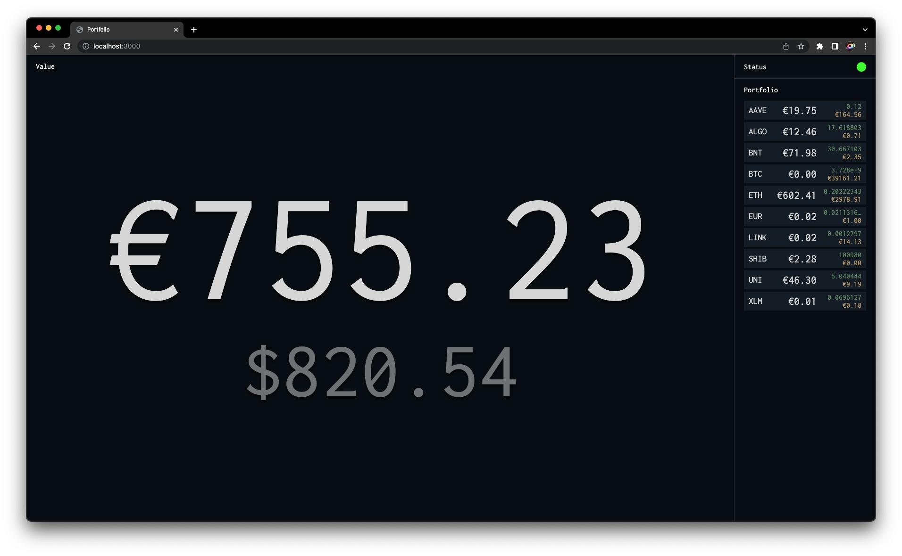

# Realtime Coinbase Pro portfolio viewer



[](LICENSE)

## Description

Actually available for **Coinbase Pro only**.
<br>
A simple way to view your portfolio in realtime.
<br>
Based on *Nest framework*.

## Installation

```bash
$ npm install
```

## Configuration

All the configuration is stored in the `.env` file from the root directory.
<br>
You need to generate Coinbase Pro API keys from here: [Coinbase](https://pro.coinbase.com/profile/api)

```env
PORT=3000   # Webserver port

BASE_CURRENCY=EUR    # EUR or USD

TERMINAL_OUTPUT=false   # To show the portfolio in the terminal

COINBASE_API_KEY=
COINBASE_API_SECRET=
COINBASE_WSS_FEED_URL=wss://ws-feed.exchange.coinbase.com
COINBASE_PORTFOLIO_REFRESH_INTERVAL=600  # In seconds (10 minutes by default)
```

## Running the app

```bash
# development
$ npm run start

# watch mode
$ npm run start:dev

# production mode
$ npm run start:prod
```

## Viewer

Just open your browser and go to [http://localhost:3000/](http://localhost:3000/)

## Stay in touch

- Author - [Robert Cojocaru](https://github.com/Robertndrei)
- Website - [https://www.xiltec.es](https://www.xiltec.es/)

## License

This project is licensed under the MIT License - see the [License](LICENSE) file for details

